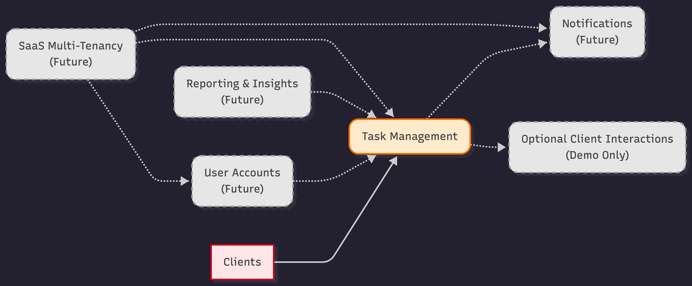
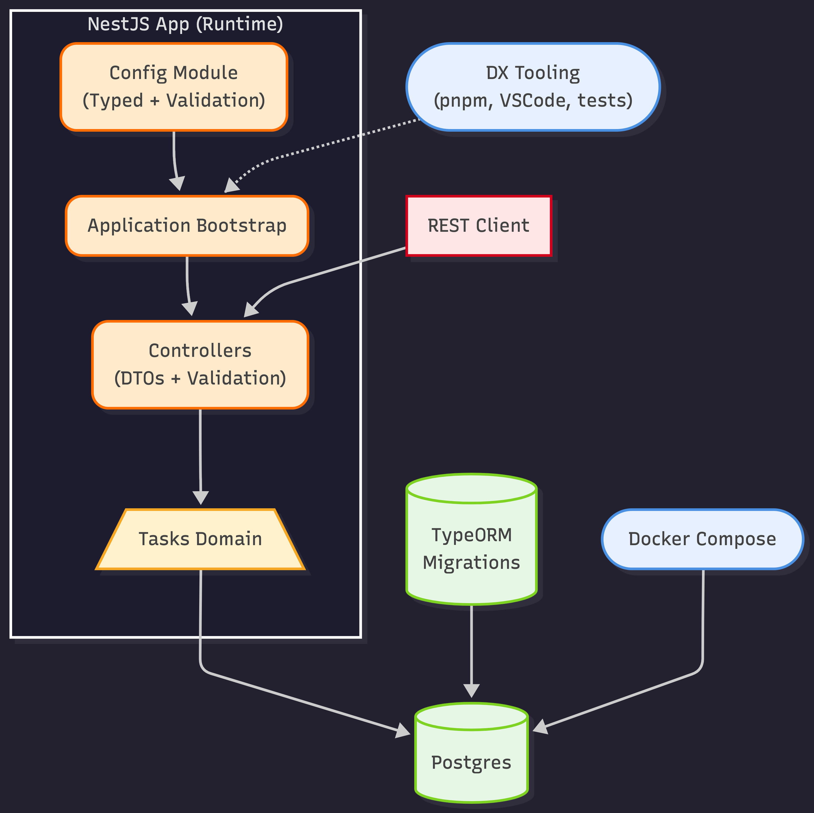
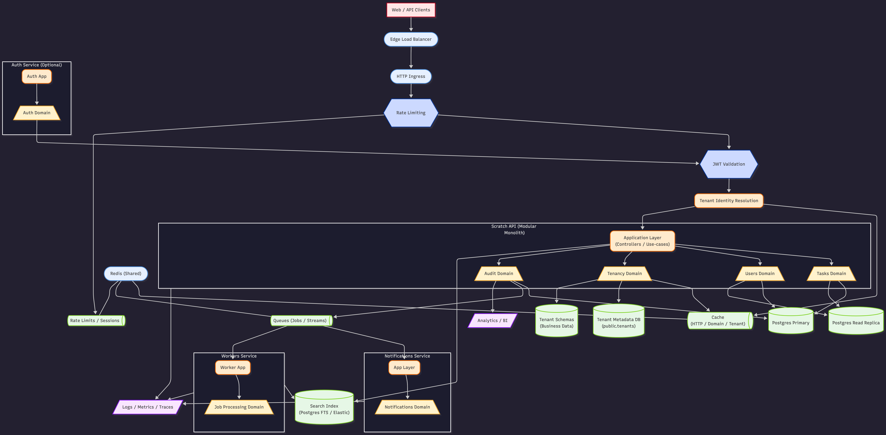

# 🏗️ Architecture Overview

## 💡 Purpose

Scratch is a backend-first task management system designed as a practical foundation for studying production-grade backend architecture and development practices.

Any client or UI is intentionally minimal and exists only to exercise backend contracts and demonstrate end-to-end flows.

## ⚠️ Problem Context

Teams and individuals need a simple, reliable task backend that is easy to reason about, extend, and evolve.

Scratch serves as a production-minded learning and demonstration system: intentionally lightweight in early phases, with a clearly scoped path toward SaaS-grade capabilities.

## 🎯 Goals

- Reliable backend using NestJS, Postgres, TypeORM, and strict typing.
- Strong developer experience with migrations, typed config, environment handling, tests, and VSCode tasks.
- Optional, minimal client used only to demonstrate API usage and validate end-to-end flows (non-essential; Vite + React).
- Incremental roadmap for data modeling, auth, jobs, observability, CI/CD, and SaaS features.
- Minimal responsive UI (Vite + React) demonstrating the “scratch” gesture.

## 🚫 Non-Goals (for MVP)

- Full-featured UI or mobile apps
- Multi-tenant SaaS capabilities (Phase 7)
- Microservices architecture
- Heavy infra (ELK, Jaeger, complex gateways)
- Real-time collaboration or offline mode

---

# 🧱 High-Level Design

Scratch is currently a modular monolith with clear boundaries and a straightforward path toward future modularization or service extraction.

The system is designed so that all meaningful complexity, invariants, and evolution live in the backend; clients remain replaceable and disposable.

## Current structure (Phase 1)

- `src/tasks` — CRUD logic
- `src/config` — typed factories + validation
- `src/common` — pipes, decorators, shared utilities
- TypeORM Data Source + migrations
- Docker Compose for Postgres
- VSCode tasks + pnpm scripts

## Future structure (Phases 2–7)

- Modules: `auth`, `users`, `notifications`, `jobs`, `billing`, `tenancy`
- Infra integrations: Redis, BullMQ, email provider, Prometheus exporter
- CI/CD pipelines and deployment automation
- Optional service extraction for notifications, worker pool, etc.

---

# 🧩 Core Components

## 🟠 API Layer (NestJS)

- Controllers expose REST API
- Services encapsulate domain logic
- DTOs + ValidationPipe enforce contract
- Typed config injected via ConfigModule
- Custom pipes (ParseNullableInt) & decorators (CurrentUser)

## 🟡 Domain Services

- Task management: domain rules, CRUD operations, state transitions, and bulk operations
- Future:
	- Auth & users
	- Tags, attachments
	- Quick-action policies
	- Tenant isolation

## 🟢 Persistence Layer

- Primary SQL store: Postgres via TypeORM
- Schema: evolution strictly via migrations (synchronize disabled outside early experimentation)
- Indexes: ownerId, status, priority
Future integrations:
- Redis (cache, sessions, rate-limit, jobs)
- Horizontal queue (BullMQ / Redis streams)
- Object storage for attachments
- Search index (Postgres FTS or Elastic)

## 🔵 Infrastructure & Integration

- Docker Compose (Postgres)
- pnpm scripts for migrations, seeds, DX
- Future (when justified by scale):
	- API gateway and ingress
	- GitHub Actions CI
	- Helm charts / K8s manifests

## 🔷 Security & Resilience (later phases)

- JWT access + refresh tokens
- Rate limiting (Nest Throttler)
- Helmet, CORS, CSRF considerations
- Error boundaries, retries, structured logging

## 🟣 Observability & Cross-cutting

- Logging (Pino or Winston)
- `/health` endpoint
- Prometheus metrics (Phase 6)
- Auditing & event logging (future)

---

# ⚖️ Major Trade-offs

## Monolith-first strategy

- faster iteration
- simpler testing
- easier onboarding

Microservices deferred until complexity justifies them.

## TypeORM chosen over Prisma

- deeper Nest integration
- lifecycle hooks
- fine-grained control via migrations

(Prisma remains an option for future phases.)

## Minimal UI, backend-focused

Any frontend remains intentionally minimal and non-essential.

Its sole purpose is to exercise backend APIs and validate end-to-end behavior; it is not a product surface.

## Light infra early on

Redis, queues, object storage and observability stack appear only when needed (Phases 4–7).

---

# 🔀 Example Flow — Create → Scratch Action

This flow illustrates how a thin client may interact with the backend. The backend remains the source of truth for all behavior.

1. Frontend sends `POST /api/tasks` with `CreateTaskDto`
2. DTO validated → `TaskEntity` saved → `TaskResponseDto` returned
3. UI renders `TaskCard`
4. User performs scratch gesture (quick lateral oscillation)
5. Frontend opens quick-action menu:
	- Complete
	- Snooze
	- Randomize priority
	- Delete
6. PATCH request sent → service updates entity → DB persists → optimistic UI update

---

# 📊 Executive View (business capabilities)

A high-level map of the system’s capabilities: task management, user accounts, notifications, quick actions, data storage, and observability.

---

# ⚙️ MVP Technical View (Phase 1)

Shows the minimal set of components: API, DB, config, migrations, tests, and dev tooling.

---

# ⚙️ Future System View (Phases 1-7)

Illustrates the full trajectory from a simple monolith to a production-grade SaaS platform with auth, jobs, notifications, observability, CI/CD, and multi-tenant capabilities.

